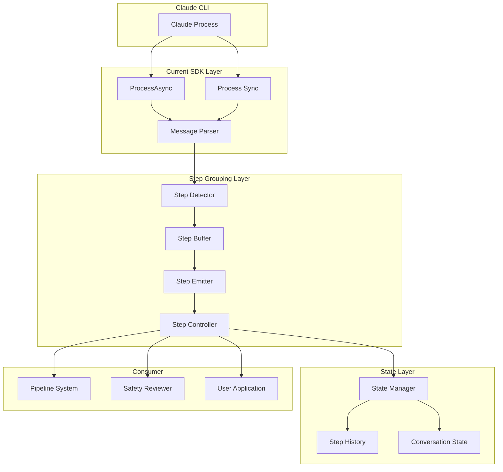

# Design Document

## Overview

The Stream Step Grouping feature transforms Claude's raw message stream into logical, reviewable steps through a multi-layered architecture. The system uses pattern-based detection to identify step boundaries, buffers messages until complete steps are formed, and provides control interfaces for pause/resume functionality. This design enables safety controls, debugging capabilities, and better observability while maintaining backward compatibility with existing SDK usage.

## Architecture

### High-Level Architecture



### Data Flow

1. **Message Ingestion**: Raw messages from Claude CLI are parsed and fed into the Step Detector
2. **Pattern Analysis**: Step Detector analyzes each message against configured patterns to identify boundaries
3. **Step Buffering**: Step Buffer accumulates messages until a complete step is detected
4. **Step Emission**: Complete steps are emitted to the Step Controller
5. **Control Processing**: Step Controller applies pause/resume logic and review handlers
6. **State Management**: State Manager persists step history and manages checkpoints
7. **Consumer Delivery**: Processed steps are delivered to consuming applications

## Components and Interfaces

### 1. Step Detector

**Purpose**: Analyzes message patterns to identify logical step boundaries

**Interface**:
```elixir
defmodule ClaudeCodeSDK.StepDetector do
  @type detection_result :: 
    {:step_start, step_type()} | 
    {:step_continue, nil} | 
    {:step_end, step_metadata()}
    
  @spec analyze_message(t(), Message.t(), [Message.t()]) :: detection_result()
  def analyze_message(detector, message, buffer)
  
  @spec new(keyword()) :: t()
  def new(opts \\ [])
end
```

**Key Features**:
- Pattern-based detection using configurable patterns
- Support for custom patterns and detection strategies
- Confidence scoring and threshold-based decisions
- Fallback to heuristic detection when patterns fail

**Built-in Patterns**:
- File Operations: Reading, writing, editing files
- Code Modifications: Refactoring, implementing features
- System Commands: Running bash/shell commands
- Exploration: Searching, browsing code structure
- Analysis: Understanding and reviewing code

### 2. Step Buffer

**Purpose**: Accumulates messages and emits complete steps with timeout handling

**Interface**:
```elixir
defmodule ClaudeCodeSDK.StepBuffer do
  @spec start_link(keyword()) :: {:ok, pid()}
  def start_link(opts)
  
  @spec add_message(pid(), Message.t()) :: :ok
  def add_message(buffer, message)
  
  @spec flush(pid()) :: :ok
  def flush(buffer)
end
```

**Key Features**:
- GenServer-based buffering with timeout handling
- Automatic step completion on timeout
- Memory management with configurable buffer limits
- Step metadata extraction and tool usage tracking

### 3. Step Stream Transformer

**Purpose**: Converts message streams into step streams

**Interface**:
```elixir
defmodule ClaudeCodeSDK.StepStream do
  @spec transform(Enumerable.t(), keyword()) :: Enumerable.t()
  def transform(message_stream, opts \\ [])
end
```

**Key Features**:
- Stream.resource-based implementation for memory efficiency
- Lazy evaluation with backpressure support
- Error handling and recovery mechanisms
- Integration with existing SDK streaming

### 4. Step Controller

**Purpose**: Manages step execution flow with pause/resume capabilities

**Interface**:
```elixir
defmodule ClaudeCodeSDK.StepController do
  @type control_mode :: :automatic | :manual | :review_required
  @type control_decision :: :continue | :pause | {:intervene, intervention} | :abort
  
  @spec start_link(Enumerable.t(), keyword()) :: {:ok, pid()}
  def start_link(step_stream, opts)
  
  @spec next_step(pid(), timeout()) :: 
    {:ok, Step.t()} | {:paused, Step.t()} | :completed | {:error, term()}
  def next_step(controller, timeout \\ 5000)
  
  @spec resume(pid(), control_decision()) :: :ok | {:error, term()}
  def resume(controller, decision \\ :continue)
end
```

**Control Modes**:
- **Automatic**: Steps execute without interruption
- **Manual**: Pause after each step for user decision
- **Review Required**: Pause for external review handler approval

### 5. State Manager

**Purpose**: Manages conversation state and step history with persistence

**Interface**:
```elixir
defmodule ClaudeCodeSDK.StateManager do
  @spec start_link(keyword()) :: {:ok, pid()}
  def start_link(opts)
  
  @spec save_step(pid(), Step.t()) :: :ok
  def save_step(manager, step)
  
  @spec create_checkpoint(pid(), String.t()) :: {:ok, checkpoint()}
  def create_checkpoint(manager, label)
  
  @spec restore_checkpoint(pid(), String.t()) :: :ok | {:error, term()}
  def restore_checkpoint(manager, checkpoint_id)
end
```

**Key Features**:
- Configurable persistence adapters (memory, file, database)
- Automatic history pruning with checkpoint preservation
- Crash recovery and state restoration
- Conversation replay capabilities

## Data Models

### Step Structure

```elixir
defmodule ClaudeCodeSDK.Step do
  defstruct [
    :id,                    # Unique step identifier
    :type,                  # Step type (:file_operation, :code_modification, etc.)
    :description,           # Human-readable description
    :messages,              # Original messages in this step
    :tools_used,            # List of tools used
    :started_at,            # Start timestamp
    :completed_at,          # Completion timestamp
    :status,                # :in_progress | :completed | :timeout | :aborted
    :metadata,              # Additional step-specific data
    :review_status,         # :pending | :approved | :rejected
    :interventions          # List of applied interventions
  ]
end
```

### Pattern Structure

```elixir
defmodule ClaudeCodeSDK.StepPattern do
  defstruct [
    :id,                    # Pattern identifier
    :name,                  # Human-readable name
    :description,           # Pattern description
    :triggers,              # List of trigger conditions
    :validators,            # List of validation rules
    :priority,              # Pattern priority (higher = more important)
    :confidence             # Confidence score (0.0 - 1.0)
  ]
end
```

### Configuration Structure

```elixir
%{
  step_grouping: %{
    enabled: true,
    strategy: :pattern_based,
    patterns: :default,
    confidence_threshold: 0.7,
    buffer_timeout_ms: 5000
  },
  step_control: %{
    mode: :automatic,
    pause_between_steps: false,
    review_handler: nil,
    intervention_handler: nil
  },
  state_management: %{
    persist_steps: true,
    persistence_adapter: nil,
    max_step_history: 100
  }
}
```

## Error Handling

### Detection Errors

- **Pattern Matching Failures**: Fall back to heuristic detection
- **Timeout Errors**: Emit incomplete steps with timeout status
- **Invalid Patterns**: Log error and skip invalid patterns
- **Memory Pressure**: Automatically trim buffers and history

### Control Errors

- **Review Handler Failures**: Default to safe action based on control mode
- **Intervention Errors**: Log error and continue without intervention
- **State Corruption**: Attempt recovery or restart with clean state
- **Timeout Errors**: Apply configured timeout behavior

### Recovery Strategies

```elixir
defmodule ClaudeCodeSDK.ErrorRecovery do
  def handle_detection_error(error, state) do
    Logger.warn("Step detection error: #{inspect(error)}")
    
    case error do
      :timeout -> emit_incomplete_step(state)
      :pattern_error -> fallback_to_heuristics(state)
      :memory_error -> trim_buffers_and_retry(state)
      _ -> default_recovery(state)
    end
  end
  
  def handle_control_error(error, step, state) do
    Logger.error("Step control error: #{inspect(error)}")
    
    case state.control_mode do
      :review_required -> {:pause, step}  # Safe default
      :manual -> {:pause, step}
      :automatic -> {:continue, step}
    end
  end
end
```

## Testing Strategy

### Unit Testing

**Step Detector Tests**:
- Pattern matching accuracy with known message sequences
- Edge case handling (incomplete messages, malformed content)
- Performance testing with large message volumes
- Custom pattern validation

**Step Buffer Tests**:
- Message accumulation and step emission
- Timeout handling and incomplete step processing
- Memory management and buffer limits
- Concurrent access and thread safety

**Step Controller Tests**:
- Control mode behavior verification
- Review handler integration
- Intervention processing
- Error recovery scenarios

### Integration Testing

**End-to-End Workflows**:
- Complete conversation processing with step grouping
- Pipeline integration with safety reviewers
- State persistence and recovery
- Performance benchmarking

**Compatibility Testing**:
- Backward compatibility with existing SDK usage
- Migration path validation
- Configuration option testing
- Error propagation verification

### Test Utilities

```elixir
defmodule ClaudeCodeSDK.TestHelpers do
  def create_test_step_stream(scenarios) do
    messages = Enum.flat_map(scenarios, &scenario_to_messages/1)
    message_stream = Stream.from_enumerable(messages)
    StepStream.transform(message_stream)
  end
  
  def mock_step_controller(decisions) do
    %MockController{
      decisions: decisions,
      current_index: 0
    }
  end
  
  def assert_step_structure(step, expected) do
    assert step.type == expected.type
    assert step.tools_used == expected.tools_used
    assert step.status == expected.status
  end
end
```

## Performance Considerations

### Memory Management

- **Buffer Limits**: Configurable maximum buffer sizes
- **History Pruning**: Automatic cleanup of old steps
- **Lazy Evaluation**: Stream-based processing to minimize memory usage
- **Object Pooling**: Reuse of step and message objects where possible

### Processing Efficiency

- **Pattern Optimization**: Pre-compiled regex patterns and indexed lookups
- **Caching**: Detection result caching for repeated patterns
- **Parallel Processing**: Concurrent pattern evaluation where safe
- **Timeout Management**: Configurable timeouts to prevent blocking

### Streaming Performance

- **Backpressure**: Proper backpressure handling in stream transformation
- **Buffering Strategy**: Optimal buffer sizes for different use cases
- **Error Recovery**: Fast recovery from transient errors
- **Resource Cleanup**: Proper cleanup of GenServer processes and resources

## Security Considerations

### Input Validation

- **Message Sanitization**: Validate message structure and content
- **Pattern Safety**: Prevent regex DoS attacks in custom patterns
- **Configuration Validation**: Validate all configuration options
- **Resource Limits**: Enforce limits on buffer sizes and processing time

### Access Control

- **Review Handler Security**: Validate review handler implementations
- **Intervention Validation**: Sanitize intervention content
- **State Access**: Control access to conversation state and history
- **Persistence Security**: Secure storage of step history and checkpoints

### Error Information

- **Sensitive Data**: Avoid logging sensitive information in error messages
- **Stack Traces**: Sanitize stack traces in production
- **Debug Information**: Control debug information exposure
- **Audit Logging**: Log security-relevant events for monitoring

## Integration Points

### SDK Integration

The step grouping layer integrates with the existing SDK through:

```elixir
# Existing API functions work exactly as before (DEFAULT BEHAVIOR)
ClaudeCodeSDK.query/2           # Unchanged - returns messages as before
ClaudeCodeSDK.query_stream/2    # Unchanged - streams messages as before

# New optional API functions for step grouping
ClaudeCodeSDK.query_with_steps/2    # NEW - returns step stream
ClaudeCodeSDK.query_with_control/2  # NEW - returns controlled step stream

# Optional stream transformation
ClaudeCodeSDK.StepStream.transform/2  # NEW - transforms existing streams

# Step grouping is DISABLED by default
# Users must explicitly enable it via configuration
```

**Default Behavior**: All existing code continues to work without any changes. Step grouping is an opt-in feature that must be explicitly enabled.

### Pipeline System Integration

```yaml
# Pipeline configuration example
steps:
  - type: claude_code
    config:
      prompt: "Refactor the authentication module"
      step_grouping:
        enabled: true
        patterns: [:code_modification, :file_operation]
      step_control:
        mode: :review_required
        review_handler: "Pipeline.Safety.StepReviewer"
```

### External System Integration

- **Safety Reviewers**: Async review handler interface
- **Monitoring Systems**: Telemetry events and metrics
- **Persistence Systems**: Pluggable persistence adapters
- **Notification Systems**: Step completion and error notifications

## Deployment Strategy

### Configuration Management

```elixir
# config/config.exs
config :claude_code_sdk,
  step_grouping: [
    enabled: false,  # DISABLED BY DEFAULT - preserves existing behavior
    default_strategy: :pattern_based,
    default_patterns: :default,
    default_confidence_threshold: 0.7,
    default_buffer_timeout_ms: 5000
  ]
```

**Key Points**:
- Step grouping is **disabled by default**
- Existing `ClaudeCodeSDK.query/2` and `ClaudeCodeSDK.query_stream/2` work exactly as before
- Users must explicitly opt-in to step grouping by using new APIs or enabling the feature
- Zero impact on existing codebases

### Feature Flags

- **Gradual Rollout**: Feature flags for gradual adoption
- **A/B Testing**: Compare step grouping vs. traditional processing
- **Fallback Mechanism**: Automatic fallback on errors
- **Performance Monitoring**: Real-time performance metrics

### Migration Path

1. **Phase 1**: Deploy with step grouping disabled by default (preserves all existing behavior)
2. **Phase 2**: Enable for internal testing and validation using new APIs
3. **Phase 3**: Gradual rollout to external users who opt-in
4. **Phase 4**: Encourage adoption through documentation and examples
5. **Phase 5**: Keep both approaches available long-term (no deprecation planned)

**Important**: The existing message-based processing will remain the default and will not be deprecated. This ensures existing applications continue to work without any changes.

This design provides a comprehensive foundation for implementing the Stream Step Grouping feature while maintaining compatibility, performance, and safety requirements.