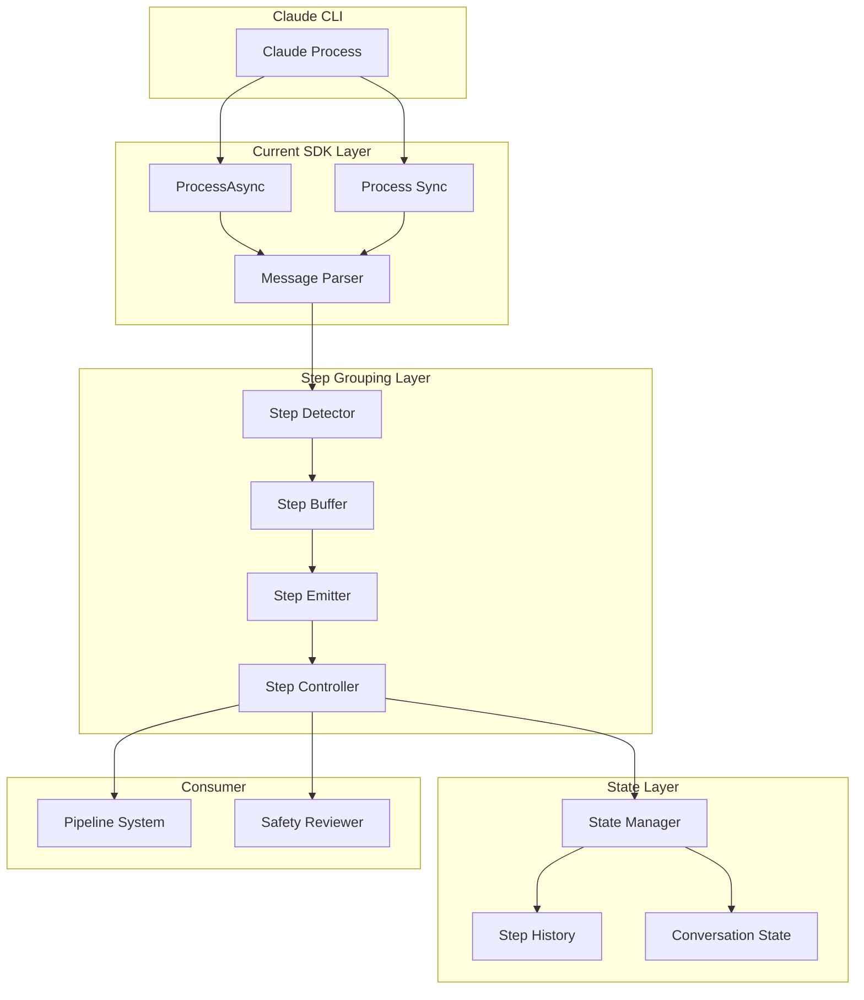

# Stream Step Grouping - Technical Architecture

## System Architecture

### Component Overview



## Core Components

### 1. Step Detector (`ClaudeCodeSDK.StepDetector`)

Responsible for analyzing message patterns and identifying step boundaries.

```elixir
defmodule ClaudeCodeSDK.StepDetector do
  @moduledoc """
  Detects logical step boundaries in Claude's message stream
  """
  
  defstruct [:strategy, :patterns, :state, :config]
  
  @type detection_strategy :: :pattern_based | :ml_based | :custom
  
  @type step_pattern :: %{
    name: atom(),
    start_pattern: pattern_matcher(),
    end_pattern: pattern_matcher(),
    required_elements: [atom()],
    priority: integer()
  }
  
  @type pattern_matcher :: 
    {:text, Regex.t()} |
    {:tool_use, String.t()} |
    {:sequence, [pattern_matcher()]} |
    {:any_of, [pattern_matcher()]}
    
  @doc """
  Analyzes a message to determine if it represents a step boundary
  """
  @spec analyze_message(t(), Message.t(), [Message.t()]) :: 
    {:step_start, step_type()} | 
    {:step_continue, nil} | 
    {:step_end, step_metadata()}
    
  def analyze_message(detector, message, buffer) do
    case detector.strategy do
      :pattern_based ->
        analyze_with_patterns(detector, message, buffer)
      :ml_based ->
        analyze_with_ml(detector, message, buffer)
      :custom ->
        apply(detector.config.custom_analyzer, [message, buffer])
    end
  end
  
  # Built-in patterns for common step types
  @patterns %{
    file_operation: %{
      name: :file_operation,
      start_pattern: {:text, ~r/let me (read|check|examine|look at)/i},
      end_pattern: {:sequence, [
        {:tool_use, "read"},
        {:tool_result, :any},
        {:text, :any}
      ]},
      required_elements: [:tool_use],
      priority: 10
    },
    
    code_modification: %{
      name: :code_modification,
      start_pattern: {:text, ~r/I'll (modify|update|change|fix)/i},
      end_pattern: {:sequence, [
        {:tool_use, "edit"},
        {:tool_result, :any},
        {:text, ~r/(done|completed|updated)/i}
      ]},
      required_elements: [:tool_use, :tool_result],
      priority: 15
    },
    
    exploration: %{
      name: :exploration,
      start_pattern: {:text, ~r/let me (explore|search|find|look for)/i},
      end_pattern: {:any_of, [
        {:text, ~r/found|discovered|located/i},
        {:sequence, [
          {:tool_use, :any},
          {:tool_result, :any}
        ]}
      ]},
      required_elements: [],
      priority: 5
    }
  }
end
```

### 2. Step Buffer (`ClaudeCodeSDK.StepBuffer`)

Accumulates messages until a complete step is formed.

```elixir
defmodule ClaudeCodeSDK.StepBuffer do
  @moduledoc """
  Buffers messages and emits complete steps
  """
  
  use GenServer
  
  defstruct [
    :current_step,
    :message_buffer,
    :timeout_ref,
    :config,
    :step_detector,
    :emit_callback
  ]
  
  @type step :: %{
    id: String.t(),
    type: atom(),
    description: String.t(),
    messages: [Message.t()],
    tools_used: [String.t()],
    started_at: DateTime.t(),
    completed_at: DateTime.t() | nil,
    status: :in_progress | :completed | :timeout,
    metadata: map()
  }
  
  def start_link(opts) do
    GenServer.start_link(__MODULE__, opts)
  end
  
  def add_message(buffer, message) do
    GenServer.call(buffer, {:add_message, message})
  end
  
  def handle_call({:add_message, message}, _from, state) do
    new_state = process_message(state, message)
    {:reply, :ok, new_state}
  end
  
  defp process_message(state, message) do
    detection = StepDetector.analyze_message(
      state.step_detector,
      message,
      state.message_buffer
    )
    
    case detection do
      {:step_start, type} ->
        # Emit previous step if exists
        state = maybe_emit_step(state)
        
        # Start new step
        %{state |
          current_step: create_new_step(type, message),
          message_buffer: [message],
          timeout_ref: schedule_timeout(state.config.timeout_ms)
        }
        
      {:step_continue, _} ->
        # Add to current step
        %{state |
          message_buffer: state.message_buffer ++ [message]
        }
        
      {:step_end, metadata} ->
        # Complete and emit current step
        updated_step = complete_step(state.current_step, metadata)
        emit_step(updated_step, state.emit_callback)
        
        %{state |
          current_step: nil,
          message_buffer: [],
          timeout_ref: cancel_timeout(state.timeout_ref)
        }
    end
  end
  
  defp create_new_step(type, first_message) do
    %{
      id: generate_step_id(),
      type: type,
      description: extract_description(first_message),
      messages: [first_message],
      tools_used: [],
      started_at: DateTime.utc_now(),
      completed_at: nil,
      status: :in_progress,
      metadata: %{}
    }
  end
  
  defp schedule_timeout(timeout_ms) do
    Process.send_after(self(), :step_timeout, timeout_ms)
  end
  
  def handle_info(:step_timeout, state) do
    # Force emit incomplete step
    if state.current_step do
      timeout_step = %{state.current_step | 
        status: :timeout,
        completed_at: DateTime.utc_now()
      }
      emit_step(timeout_step, state.emit_callback)
    end
    
    {:noreply, %{state | 
      current_step: nil,
      message_buffer: [],
      timeout_ref: nil
    }}
  end
end
```

### 3. Step Stream Transformer (`ClaudeCodeSDK.StepStream`)

Transforms message streams into step streams.

```elixir
defmodule ClaudeCodeSDK.StepStream do
  @moduledoc """
  Transforms message streams into step streams
  """
  
  @doc """
  Converts a message stream into a step stream
  """
  def transform(message_stream, opts \\ []) do
    {:ok, buffer} = StepBuffer.start_link(
      config: Keyword.get(opts, :config, default_config()),
      step_detector: create_detector(opts),
      emit_callback: self()
    )
    
    # Create a new stream that processes messages and emits steps
    Stream.resource(
      # Start function
      fn -> 
        %{
          buffer: buffer,
          message_stream: message_stream,
          pending_steps: :queue.new()
        }
      end,
      
      # Next function
      fn state ->
        case get_next_element(state) do
          {:message, message, new_state} ->
            StepBuffer.add_message(state.buffer, message)
            {[], new_state}
            
          {:step, step, new_state} ->
            {[step], new_state}
            
          {:done, new_state} ->
            {:halt, new_state}
        end
      end,
      
      # Cleanup function
      fn state ->
        GenServer.stop(state.buffer)
      end
    )
  end
  
  defp get_next_element(state) do
    # Check for pending steps first
    case :queue.out(state.pending_steps) do
      {{:value, step}, new_queue} ->
        {:step, step, %{state | pending_steps: new_queue}}
        
      {:empty, _} ->
        # Try to get next message
        case Stream.take(state.message_stream, 1) do
          [message] ->
            {:message, message, state}
          [] ->
            {:done, state}
        end
    end
  end
end
```

### 4. Step Controller (`ClaudeCodeSDK.StepController`)

Manages pause/resume and intervention logic.

```elixir
defmodule ClaudeCodeSDK.StepController do
  @moduledoc """
  Controls step execution flow with pause/resume capabilities
  """
  
  use GenServer
  
  defstruct [
    :step_stream,
    :control_mode,
    :review_handler,
    :intervention_handler,
    :state,
    :current_step,
    :pending_intervention
  ]
  
  @type control_mode :: :automatic | :manual | :review_required
  
  @type control_decision :: 
    :continue | 
    :pause | 
    {:intervene, intervention} |
    :abort
    
  def start_link(step_stream, opts) do
    GenServer.start_link(__MODULE__, {step_stream, opts})
  end
  
  def init({step_stream, opts}) do
    state = %__MODULE__{
      step_stream: step_stream,
      control_mode: Keyword.get(opts, :control_mode, :automatic),
      review_handler: Keyword.get(opts, :review_handler),
      intervention_handler: Keyword.get(opts, :intervention_handler),
      state: :running
    }
    
    {:ok, state}
  end
  
  @doc """
  Gets the next step, applying control logic
  """
  def next_step(controller, timeout \\ 5000) do
    GenServer.call(controller, :next_step, timeout)
  end
  
  @doc """
  Resumes execution after a pause
  """
  def resume(controller, decision \\ :continue) do
    GenServer.call(controller, {:resume, decision})
  end
  
  @doc """
  Injects an intervention before the next step
  """
  def inject_intervention(controller, intervention) do
    GenServer.call(controller, {:inject, intervention})
  end
  
  def handle_call(:next_step, _from, state) do
    case state.state do
      :running ->
        handle_running_state(state)
        
      :paused ->
        {:reply, {:paused, state.current_step}, state}
        
      :awaiting_review ->
        {:reply, {:awaiting_review, state.current_step}, state}
        
      :completed ->
        {:reply, :completed, state}
    end
  end
  
  defp handle_running_state(state) do
    # Check for pending intervention
    if state.pending_intervention do
      apply_intervention(state)
    else
      # Get next step from stream
      case Stream.take(state.step_stream, 1) do
        [step] ->
          process_step(step, state)
        [] ->
          {:reply, :completed, %{state | state: :completed}}
      end
    end
  end
  
  defp process_step(step, state) do
    # Apply control logic
    decision = evaluate_step(step, state)
    
    case decision do
      :continue ->
        {:reply, {:ok, step}, state}
        
      :pause ->
        new_state = %{state | 
          state: :paused,
          current_step: step
        }
        {:reply, {:paused, step}, new_state}
        
      {:intervene, intervention} ->
        new_state = %{state |
          pending_intervention: intervention,
          current_step: step
        }
        {:reply, {:intervention_required, intervention}, new_state}
        
      :abort ->
        {:reply, {:aborted, step}, %{state | state: :completed}}
    end
  end
  
  defp evaluate_step(step, state) do
    cond do
      # Check control mode
      state.control_mode == :manual ->
        :pause
        
      # Check review requirement
      state.control_mode == :review_required && state.review_handler ->
        case state.review_handler.(step) do
          :approved -> :continue
          :pause -> :pause
          {:intervene, intervention} -> {:intervene, intervention}
          :abort -> :abort
        end
        
      # Default to continue
      true ->
        :continue
    end
  end
end
```

### 5. State Manager (`ClaudeCodeSDK.StateManager`)

Manages conversation state and step history.

```elixir
defmodule ClaudeCodeSDK.StateManager do
  @moduledoc """
  Manages conversation state and step history
  """
  
  use GenServer
  
  defstruct [
    :conversation_id,
    :step_history,
    :current_position,
    :checkpoints,
    :persistence_adapter
  ]
  
  def start_link(opts) do
    GenServer.start_link(__MODULE__, opts)
  end
  
  def save_step(manager, step) do
    GenServer.call(manager, {:save_step, step})
  end
  
  def get_history(manager) do
    GenServer.call(manager, :get_history)
  end
  
  def create_checkpoint(manager, label) do
    GenServer.call(manager, {:create_checkpoint, label})
  end
  
  def restore_checkpoint(manager, checkpoint_id) do
    GenServer.call(manager, {:restore_checkpoint, checkpoint_id})
  end
  
  def handle_call({:save_step, step}, _from, state) do
    new_history = state.step_history ++ [step]
    
    # Persist if adapter configured
    if state.persistence_adapter do
      state.persistence_adapter.save_step(state.conversation_id, step)
    end
    
    new_state = %{state | 
      step_history: new_history,
      current_position: length(new_history)
    }
    
    {:reply, :ok, new_state}
  end
  
  def handle_call(:get_history, _from, state) do
    {:reply, state.step_history, state}
  end
  
  def handle_call({:create_checkpoint, label}, _from, state) do
    checkpoint = %{
      id: generate_checkpoint_id(),
      label: label,
      position: state.current_position,
      created_at: DateTime.utc_now(),
      state_snapshot: create_state_snapshot(state)
    }
    
    new_state = %{state |
      checkpoints: state.checkpoints ++ [checkpoint]
    }
    
    {:reply, {:ok, checkpoint}, new_state}
  end
end
```

## Integration with Existing SDK

### 1. Backward Compatibility

The step grouping layer is designed as an optional enhancement:

```elixir
# Traditional usage (unchanged)
{:ok, messages} = ClaudeCodeSDK.query(prompt, config)

# New step-based usage
{:ok, steps} = ClaudeCodeSDK.query_with_steps(prompt, config)

# Or transform existing stream
message_stream = ClaudeCodeSDK.query_stream(prompt, config)
step_stream = ClaudeCodeSDK.StepStream.transform(message_stream)
```

### 2. Configuration Integration

```elixir
defmodule ClaudeCodeSDK.Config do
  def add_step_config(base_config, step_options) do
    Map.merge(base_config, %{
      step_grouping: %{
        enabled: true,
        detection_strategy: Keyword.get(step_options, :strategy, :pattern_based),
        buffer_timeout_ms: Keyword.get(step_options, :timeout, 5000),
        patterns: Keyword.get(step_options, :patterns, :default)
      },
      step_control: %{
        mode: Keyword.get(step_options, :control_mode, :automatic),
        review_handler: Keyword.get(step_options, :review_handler),
        pause_between_steps: Keyword.get(step_options, :pause_between, false)
      }
    })
  end
end
```

### 3. Process Integration

For ProcessAsync:

```elixir
defmodule ClaudeCodeSDK.ProcessAsync do
  # Add step grouping support
  def execute_with_steps(command, args, opts) do
    # Execute normally but wrap output
    {:ok, pid} = execute(command, args, opts)
    
    # Get message stream
    message_stream = receive_and_parse_messages(pid)
    
    # Transform to steps if requested
    if Keyword.get(opts, :group_steps, false) do
      StepStream.transform(message_stream, opts)
    else
      message_stream
    end
  end
end
```

## Data Structures

### Step Structure

```elixir
defmodule ClaudeCodeSDK.Step do
  defstruct [
    :id,                    # Unique step identifier
    :type,                  # Step type (e.g., :file_operation, :code_modification)
    :description,           # Human-readable description
    :messages,              # Original messages in this step
    :tools_used,            # List of tools used
    :started_at,            # Start timestamp
    :completed_at,          # Completion timestamp
    :status,                # :in_progress | :completed | :timeout
    :metadata,              # Additional step-specific data
    :review_status,         # :pending | :approved | :rejected
    :interventions          # List of applied interventions
  ]
  
  @type t :: %__MODULE__{
    id: String.t(),
    type: atom(),
    description: String.t(),
    messages: [Message.t()],
    tools_used: [String.t()],
    started_at: DateTime.t(),
    completed_at: DateTime.t() | nil,
    status: atom(),
    metadata: map(),
    review_status: atom() | nil,
    interventions: [intervention()]
  }
  
  @type intervention :: %{
    type: atom(),
    content: String.t(),
    applied_at: DateTime.t()
  }
end
```

### Control Response Structure

```elixir
defmodule ClaudeCodeSDK.ControlResponse do
  defstruct [
    :decision,              # :continue | :pause | :abort
    :intervention,          # Optional intervention to apply
    :reason,                # Explanation for the decision
    :metadata              # Additional control data
  ]
  
  @type t :: %__MODULE__{
    decision: atom(),
    intervention: map() | nil,
    reason: String.t() | nil,
    metadata: map()
  }
end
```

## Performance Considerations

### 1. Streaming Efficiency

- Minimal buffering overhead
- Lazy evaluation where possible
- Configurable buffer sizes

### 2. Memory Management

```elixir
defmodule ClaudeCodeSDK.StepBuffer.MemoryManager do
  @max_buffer_size 100
  @max_step_messages 50
  
  def trim_buffer(buffer) when length(buffer) > @max_buffer_size do
    Enum.take(buffer, -@max_buffer_size)
  end
  
  def trim_step_messages(step) do
    if length(step.messages) > @max_step_messages do
      %{step | 
        messages: Enum.take(step.messages, @max_step_messages),
        metadata: Map.put(step.metadata, :truncated, true)
      }
    else
      step
    end
  end
end
```

### 3. Timeout Handling

- Configurable timeouts per step
- Graceful handling of incomplete steps
- Automatic emission on timeout

## Error Handling

### 1. Detection Errors

```elixir
def handle_detection_error(error, state) do
  Logger.warn("Step detection error: #{inspect(error)}")
  
  # Fall back to time-based grouping
  fallback_detection(state)
end
```

### 2. Control Errors

```elixir
def handle_control_error(error, step, state) do
  Logger.error("Step control error: #{inspect(error)}")
  
  # Default to safe action
  case state.control_mode do
    :review_required -> {:pause, step}
    _ -> {:continue, step}
  end
end
```

## Testing Support

### 1. Test Helpers

```elixir
defmodule ClaudeCodeSDK.StepTestHelper do
  def create_test_step_stream(scenarios) do
    messages = Enum.flat_map(scenarios, &scenario_to_messages/1)
    message_stream = Stream.from_enumerable(messages)
    StepStream.transform(message_stream)
  end
  
  def scenario_to_messages(:file_read) do
    [
      %Message{type: :assistant, content: "Let me read that file"},
      %Message{type: :assistant, content: tool_use("read", %{file: "test.txt"})},
      %Message{type: :assistant, content: tool_result("file contents")},
      %Message{type: :assistant, content: "The file contains..."}
    ]
  end
end
```

### 2. Mock Controllers

```elixir
defmodule ClaudeCodeSDK.MockStepController do
  def create(decisions) do
    %{
      decisions: decisions,
      current_index: 0,
      review_handler: fn step ->
        decision = Enum.at(decisions, current_index)
        increment_index()
        decision
      end
    }
  end
end
```